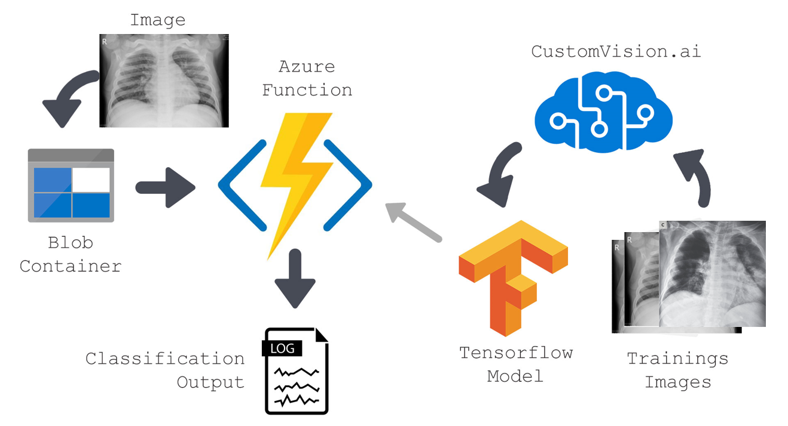

# AzureCustomVisionCOVID-19
As we continue to face the rapid increase in confirmed Coronavirus cases in India, we intend to create a robust pneumonia detection platform for COVID-19. The purpose is to assist doctors and radiologists in recognizing patients who are infected.The system is built to automatically detect high-risk patients with pneumonia or other chest diseases that will then send the information to doctors and health care professionals via secure network. With that information, the doctors are then able to make decisions and provide a treatment plan for the diagnosis and treatment. Any x-ray images taken for patients will automatically be uploaded to our system. Our system will then scan the images to determine whether the patients are infected. If the test is positive, the doctors will receive an e-Alert (on computer or mobile phone) that contains the original scans and detection results. Fast and Cheap Computer aided Diagnosis will prove extremely beneficial for people in rural India where there is acute paucity of trained radiologists and Doctors per capita. We will create an end-to-end Deep learning solution for Chest X-ray diagnosis. It will be a cost-effective solution for rural population with inadequate access to diagnostic imaging specialists.

## Why use Azure Functions? 
The serverless model differs from VMs and containers in that you only pay for the processing time used by each function as it executes.
VMs and containers are charged while they're running - even if the applications on them are idle.
This architecture doesn't work for every app - but when the app logic can be separated to independent units, we can test them separately,
update them separately, and launch them in microseconds, making this approach the fastest option for deployment.


# Custom Vision Dockerfile
Exported from AbhijitCOVID19 customvision.ai.

## Build

```bash
docker build -t <your image name> .
```

### Build ARM container on x64 machine

Export "ARM" Dockerfile from customvision.ai. Then build it using docker buildx command.
```bash
docker buildx build --platform linux/arm/v7 -t <your image name> --load .
```

## Run the container locally
```bash
docker run -p 127.0.0.1:80:80 -d <your image name>
```

## Image resizing
By default, we run manual image resizing to maintain parity with CVS webservice prediction results.
If parity is not required, you can enable faster image resizing by uncommenting the lines installing OpenCV in the Dockerfile.

Then use your favorite tool to connect to the end points.

POST http://127.0.0.1/image with multipart/form-data using the imageData key
e.g
    curl -X POST http://127.0.0.1/image -F imageData=@some_file_name.jpg

POST http://127.0.0.1/image with application/octet-stream
e.g.
    curl -X POST http://127.0.0.1/image -H "Content-Type: application/octet-stream" --data-binary @some_file_name.jpg

POST http://127.0.0.1/url with a json body of { "url": "<test url here>" }
e.g.
    curl -X POST http://127.0.0.1/url -d '{ "url": "<test url here>" }'

For information on how to use these files to create and deploy through check out the readme.txt in the *azureml* directory (./COVID19_Docker_binary_linux/azureml/README.txt).


### Part II Instructions for running the Chest X-ray diagnostics model 
1) Unzip the the zip archive (link avaialble on request)
2) create conda environment using environment.yml file:
    "conda env create -f environment.yml"
3) Go to the gui folder and run Abhijit.py file
4) This will open up multilabel chest X-ray disease classifier 


### Part II Instructions for running Tensorflow.js model :
1) Install the Tensorflow.js package for custom-vision models :
2) Replace the "model.json" with one given in the repo
#### customvision-tfjs
NPM package for TensorFlow.js models exported from Custom Vision Service

#### Install
```sh
npm install @microsoft/customvision-tfjs
```

Or, if you would like to use CDN,

```html
<script src="https://cdn.jsdelivr.net/npm/@tensorflow/tfjs@1.3.2/dist/tf.min.js"></script>
<script src="https://unpkg.com/@microsoft/customvision-tfjs"></script>
```

#### Usage

```html

```

#### Classification
```js
import * as cvstfjs from '@microsoft/customvision-tfjs';

let model = new cvstfjs.ClassificationModel();
await model.loadModelAsync('model.json');
const image = document.getElementById('image');
const result = await model.executeAsync(image);
```

The result is a 1D-array of probabilities.

## Extra
The repo contains exported ONNX model too.
